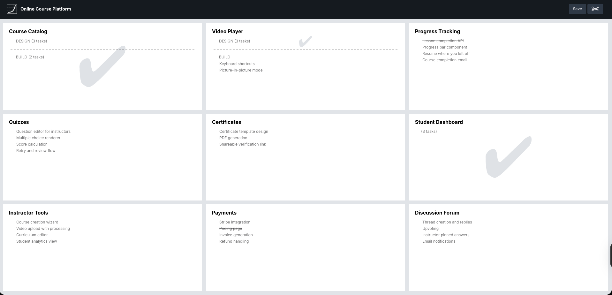

# Vertical

**Tickets pile up, scopes get done. Project work isn't linear, it's Vertical.**

Vertical is a file-based project management tool that organizes work into vertical slices that can each be completed independently. No accounts, no cloud, no setup. Just a `.vertical` file and your terminal.



```
npx itsvertical new my-project.vertical "My Project"
```

## Built for AI agents

Vertical is designed to be used through AI coding agents. The CLI is the primary interface — every entity is addressed by ID, every command accepts `--json` for structured output, and errors are machine-readable. An agent can create a project, break work into slices, add tasks, and track progress — all through the command line.

The browser UI (`itsvertical open`) is there for when you want to see the board visually, drag things around, or get a quick overview.

## How it works

Each slice is a box on the board. Add tasks to a box, and split it into layers when the work has distinct phases — design then build, for example. Slices get completed independently. Layers break the work within a slice into steps.

Everything is saved to a single `.vertical` file. Version it with git, share it with teammates, or let your agent manage it.

## Install

```
npm install -g itsvertical
```

Or run directly with npx:

```
npx itsvertical new my-project.vertical "My Project"
```

### Agent skill

Install the [Vertical skill](https://skills.sh/seasonedcc/vertical/vertical) to teach your AI agent how to use Vertical:

```
npx skills add seasonedcc/vertical
```

This gives agents like Claude Code, Cursor, and GitHub Copilot procedural knowledge of all Vertical commands and workflows.

## Commands

All entities are addressed by ID. Use `itsvertical show` to see IDs. Every command accepts `--json` to output the full board state as JSON (useful for agents).

### Project

```
itsvertical <file>                              # Shorthand for "open"
itsvertical new <path> <name>                   # Create a new .vertical file
itsvertical open <file>                         # Open in the browser UI
itsvertical show <file>                         # Print the board to the terminal
itsvertical show <file> --json                  # Output the board as JSON
itsvertical show <file> --box <slice-id>        # Show only a specific box
itsvertical show <file> --visual               # Show the board as a visual 3x3 grid with summary
itsvertical rename <file> <name>                # Rename the project
```

### Tasks

```
itsvertical task add <file> <layer-id> <name>   # Add a task to a layer
itsvertical task add <file> <lid> <n> --after <tid>  # Insert after a specific task
itsvertical task done <file> <task-id>          # Mark a task as done
itsvertical task undone <file> <task-id>        # Mark a task as not done
itsvertical task rename <file> <task-id> <name> # Rename a task
itsvertical task delete <file> <task-id>        # Delete a task
itsvertical task move <file> <task-id> <layer>  # Move a task to another layer
itsvertical task notes <file> <task-id>        # Print task notes
itsvertical task notes <file> <tid> --set <html>  # Set notes (HTML)
itsvertical task notes <file> <task-id> --clear   # Clear notes
```

### Boxes

```
itsvertical box rename <file> <slice-id> <name> # Rename a box
itsvertical box clear <file> <slice-id>         # Clear box name
itsvertical box swap <file> <id-1> <id-2>       # Swap two box positions
```

### Layers

```
itsvertical layer split <file> <task-id>        # Split at a task (tasks after go to new layer)
itsvertical layer merge <file> <layer-id>       # Merge with the next layer
itsvertical layer rename <file> <layer-id> <n>  # Rename a layer
itsvertical layer clear <file> <layer-id>       # Clear layer name
itsvertical layer status <file> <layer-id> done # Set status to "done"
itsvertical layer status <file> <layer-id> none # Clear status
```

### Board History

Vertical automatically tracks boards you create and open in `~/.vertical/history.json`.

```
itsvertical list                               # List all known boards
itsvertical remember <file>                    # Manually add a board to history
itsvertical forget <name-or-file>              # Remove a board from history
```

### Browser UI

`itsvertical open` (or just `itsvertical <file>`) starts a local server and opens the board in your browser. Changes are saved automatically.

## The board

Each box represents a vertical slice of work.

- **Name boxes** by clicking the title area
- **Drag boxes** to rearrange them in the grid
- **Add tasks** by clicking the input at the bottom of a box
- **Edit tasks** by clicking on them
- **Mark tasks done** with the circle checkbox
- **Add notes** to a task by clicking the sticky note icon (rich text editor with formatting, slash commands, and code blocks)
- **Drag tasks** between boxes and layers
- **Split layers** with the scissor tool (click ✂ or press **S**, then click a task to split at that point)
- **Unsplit layers** by focusing the dashed separator and pressing **Delete**
- **Set layer status** to "done" via the status dropdown

## Keyboard shortcuts

| Key | Action |
|-----|--------|
| **S** | Toggle split mode |
| **Escape** | Exit split mode / deselect |
| **Delete** / **Backspace** | Delete focused task or unsplit focused layer |
| **Enter** | Save inline edit |
| **Shift+Enter** | Save edit and create a new task below |

## The `.vertical` file

It's just JSON. You can version it with git, share it with teammates, or back it up however you like.

```json
{
  "version": 1,
  "project": { "name": "My Project" },
  "slices": [],
  "layers": [],
  "tasks": []
}
```

## Development

Source at [github.com/seasonedcc/vertical](https://github.com/seasonedcc/vertical).

### Architecture

The package has two parts:

- **SPA** (`app/`) — A React app built with Vite. The board UI. Built to `dist/`.
- **CLI** (`cli/`) — A Node.js CLI built with tsup. Starts a local HTTP server that serves the SPA and provides a read/write API for the `.vertical` file. Built to `cli/dist/`.

The CLI and SPA share code: types (`app/state/types.ts`), serialization (`app/file/format.ts`), and project creation (`app/state/initial-state.ts`).

### State management

The SPA uses `useReducer` + React Context instead of a server. All mutations are synchronous dispatches — no loaders, no fetchers, no optimistic updates needed. The reducer is at `app/state/reducer.ts`.

On mount, the SPA fetches `GET /api/project` from the CLI server. On save, it posts `POST /api/project`. That's the entire API surface.

### Build

```
pnpm run build        # builds both SPA (vite) and CLI (tsup)
pnpm run build:cli    # builds only the CLI
```

### Dev

```
pnpm run dev
```

Starts a full dev environment with Vite HMR for the SPA and auto-restart for the CLI server. Creates a `dev.vertical` file from `sample.vertical` on first run (preserved across restarts). The browser opens automatically.

- **SPA:** Vite dev server at `http://localhost:4007` with HMR
- **CLI server:** Rebuilds and restarts automatically on changes (port 3456)
- **API proxy:** Vite proxies `/api/*` to the CLI server

### Test locally

```
pnpm run build
pnpm run itsvertical -- new test-project.vertical "Test Project"
pnpm run itsvertical -- open test-project.vertical
```

### Test

```
pnpm run test
```

Unit tests use [Vitest](https://vitest.dev). Tests are co-located with source files (`*.test.ts`).

### Lint and type-check

```
pnpm run tsc
pnpm run lint
```

### Publish

Use the `/release` skill in Claude Code to publish a new version. It bumps the version, builds, and creates a GitHub release. You only need to run `npm publish` yourself (for OTP).

## Credits

Made by [Ryan Singer](https://ryansinger.co) and [Seasoned](https://www.seasoned.cc).

## License

MIT
